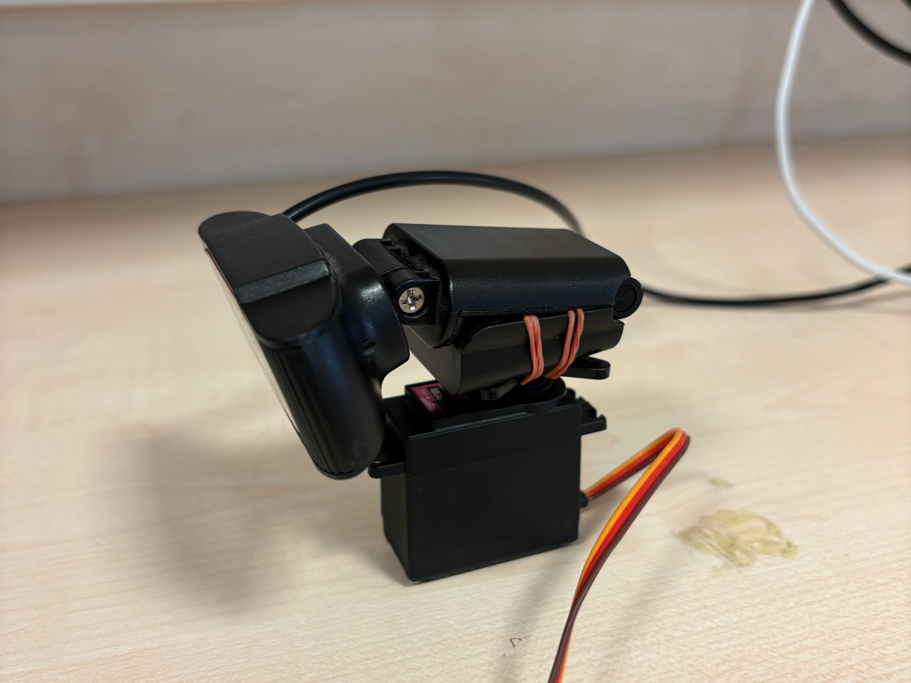
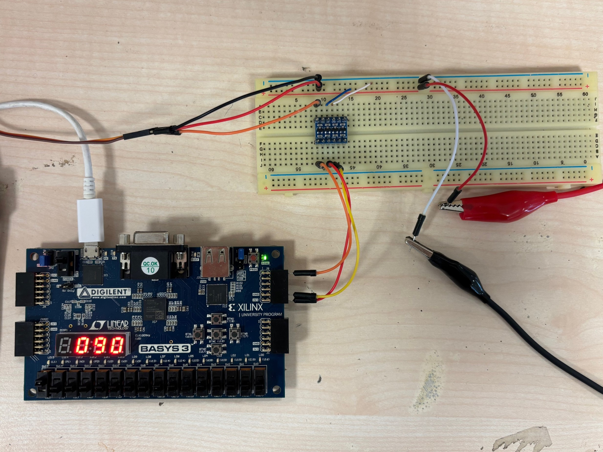

# Color-Tracking-Camera
Color tracking camera using VHDL (My final project of the course EE102 at Bilkent University). It is an FPGA based project which uses UART protol to send and recieve data between the camera and the board, also there is a python scrpit that tracks the color red and outputs the corresponding angle data.

## Youtube Video
[EE 102 Final Project: Color Tracking Camera](https://youtu.be/-ABMD4VGhRw)

## The Project Documentation
[Project Docmumentation](Project-Documentation.pdf)

## Camera Setup

## The Circuit Setup

